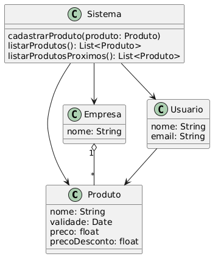
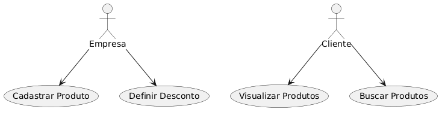
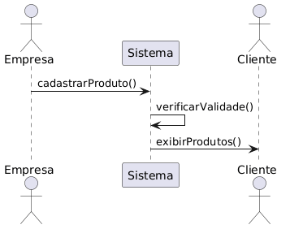

  

# 📦 ValiMarket – Plataforma de Produtos Próximos ao Vencimento

## 📑 Sumário

- 📦 [Projeto](#-1-descrição-do-projeto)
- ⚠️ [Problema](#-2-problema)
- 💡 [Solução](#-3-solução)
- 👥 [Público](#-4-público-alvo)
- ⚙️ [Funcionalidades](#-5-funcionalidades-do-sistema)
- 📐 [UML](#-modelagem-uml)
- 🎥 [Apresentação](#-apresentação-do-projeto)
- 🚀 [Execução](#-como-executar-o-projeto)

## 🎯 1. Descrição do Projeto

O projeto **ValiMarket** consiste no desenvolvimento de uma plataforma digital que conecta estabelecimentos comerciais a consumidores, com o objetivo de reduzir o desperdício de produtos próximos à data de vencimento.

A solução permite que empresas cadastrem produtos com validade próxima, oferecendo-os com desconto para consumidores finais, que podem visualizar e adquirir esses itens por meio da plataforma.

---

## ⚠️ 2. Problema

- Alto desperdício de produtos em mercados e comércios  
- Prejuízo financeiro para empresas  
- Consumidores buscam economia, mas não têm acesso fácil a esse tipo de oferta  

---

## 💡 3. Solução

Criar uma plataforma onde:

- Empresas cadastram produtos próximos ao vencimento  
- O sistema identifica automaticamente esses produtos  
- Clientes visualizam e acessam essas ofertas com desconto  

---

## 👥 4. Público-Alvo

- **Empresas:** mercados, padarias, farmácias  
- **Clientes:** consumidores que buscam economia  

---

## ⚙️ 5. Funcionalidades do Sistema

### Para Empresas:
- Cadastro de produtos  
- Inserção de data de validade  
- Definição de preço com desconto  

### Para Clientes:
- Visualização de produtos  
- Busca de produtos  
- Filtros simples (futuro)

---

## 🧠 6. Regras de Negócio

- Produtos com menos de X dias para vencer aparecem como promoção  
- O desconto é definido pelo estabelecimento  
- Produtos vencidos não são exibidos  

---

## 🏗️ 7. Tecnologias Utilizadas

- **Backend:** Python  
- **Frontend:** HTML, CSS, JavaScript  
- **Banco de dados:** JSON (inicialmente)  

---

## 📊 8. Viabilidade Técnica

O sistema pode ser desenvolvido utilizando tecnologias acessíveis e de baixo custo.

Inicialmente, a aplicação pode funcionar com arquivos JSON para armazenamento de dados, permitindo evolução futura para bancos de dados mais robustos e integração com sistemas comerciais existentes.

---

## 🔄 9. Possíveis Evoluções

- Integração com sistemas de mercado  
- Geolocalização de ofertas  
- Notificações para usuários  
- Aplicativo mobile  

---

## 📐 10. UML (Modelagem do Sistema)

Serão desenvolvidos os seguintes diagramas:

- Diagrama de Classes  
- Diagrama de Caso de Uso  
- Diagrama de Sequência  

---

## 💰 11. Modelo de Negócio (Resumo)

- Assinatura mensal para empresas  
- Comissão por venda realizada  
- Espaço para anúncios na plataforma  

---

## 🧪 12. MVP (Produto Mínimo Viável)

A primeira versão do sistema terá:

- Cadastro manual de produtos  
- Listagem de produtos próximos ao vencimento  
- Interface simples e funcional  

O objetivo do MVP é validar a ideia sem necessidade de alta complexidade técnica.

---

## 📝 13. Considerações Finais

O projeto busca unir tecnologia e impacto social, reduzindo desperdícios e promovendo economia para consumidores.

Além disso, possui potencial de expansão e escalabilidade, podendo futuramente se tornar uma solução amplamente utilizada no mercado.

---

## 📐 Modelagem UML

A modelagem UML foi utilizada para definir a estrutura e o fluxo do sistema, garantindo a organização e viabilidade técnica da solução.

### Diagrama de Classes

### Caso de Uso

### Sequência

---

## 🎥 Apresentação do Projeto

Uma versão demonstrativa do projeto e seus materiais de apresentação podem ser acessados abaixo:

- 🎬 Slides interativos:
https://jandersonhp.github.io/valimarket/slides/index.html  

- 🗣️ Pitch (roteiro):
https://jandersonhp.github.io/valimarket/roteiro/pitch.pdf  

- 📊 Modelo de Negócio (BMC):
https://jandersonhp.github.io/valimarket/roteiro/bmc.pdf  

- 🎥 Pitch em vídeo (em breve)

---

## 🚀 Como executar o projeto

1. Clonar o repositório  
git clone https://github.com/jandersonhp/valimarket.git  

2. Acessar a pasta  
cd valimarket  

3. Instalar dependências  
pip install -r requirements.txt  

4. Rodar o servidor  
python backend/app.py  

---

## 🔗 Endpoints da API

📥 Listar produtos  
GET /produtos  

➕ Adicionar produto  
POST /produtos  

⏰ Produtos próximos do vencimento  
GET /produtos/proximos  